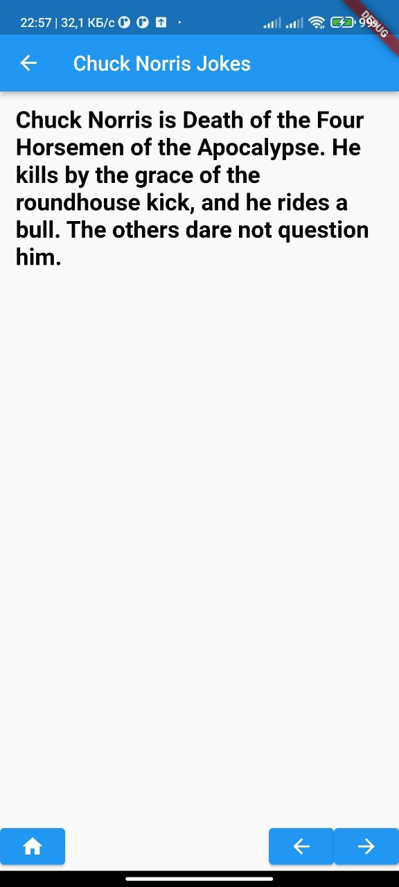

# Chuck Norris jokes

It's an application that connected to [API](https://chucknorris.io). It show's random Chuck Norris jokes. To display jokes just click **Jokes** button.

# Home Page

Home page consists of **about** section and **Jokes** button.

# Jokes Page

Joke page consists of **Joke** section and three buttons (**home**, **previous**, **next**)
 

This project is a starting point for a Flutter application.

A few resources to get you started if this is your first Flutter project:

- [Lab: Write your first Flutter app](https://docs.flutter.dev/get-started/codelab)
- [Cookbook: Useful Flutter samples](https://docs.flutter.dev/cookbook)

For help getting started with Flutter development, view the
[online documentation](https://docs.flutter.dev/), which offers tutorials,
samples, guidance on mobile development, and a full API reference.
