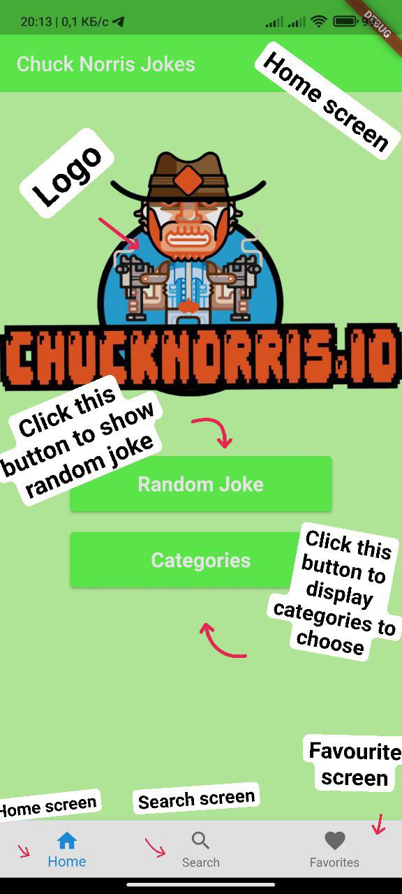
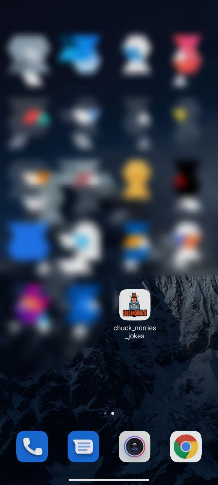

# Chuck Norris jokes 2

It's an application that connected to [API](https://chucknorris.io), that allows you to search for a joke and get joke for a certain category[random if none chosen]. It show's Chuck Norris jokes.

# Some Notes
* This is Android app
* This app is connect to API
* You are able to get joke by category or random
* In **Joke View Screen** you are able to add your joke to favorite list to access it later
* Favorite list is connected to Firebase Firestore
* You are able you search for a joke
* You need to connect to internet to use this app fully
* Custom launch App icon
* Version1 of this app is available in branch **v1**
* Enjoy using it :).

# Home Page

<!--  -->

Home page consists of two main buttons **Random Joke** and **Categories**

By clicking:

    Random Joke - get random joke from API
    
    Categories - display list of categories that you can choose and get jokes from chosen category

# Random Joke Viewer

You can click
    
    NEXT - to get new joke

    PREVIOUS - to return to previous joke

    ADD TO FAVORITE - to add displayed to joke to your favorites list

## If it's first joke screen will be a little bit different

**previous** - button will be locked

## If none of none of category chosen it will random

#### To choose category go to home->category

# Category Screen

### List of category you can choose

#

## Home Screen also consists of BottomMenu
### Which has **Home**, **Search**, **Favorites**

# Search Screen

### Search Screen consists of TextField and search button

Type some phase to find related jokes to it

Requirments are provided phase should be [3, 120] length

After providing phase click search button to search for it

## Click joke that were found to display it

# Favorite Screen
### List of jokes that you save as favorite
### Your Favorite jokes are saved in FireStore

### Click Favorite Joke to display it

# This App has custom launcher Icon

